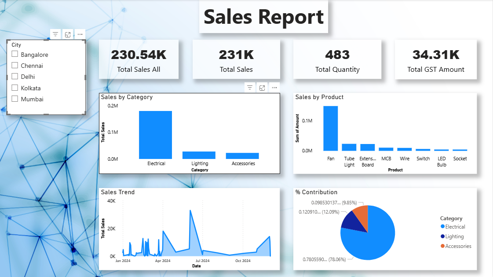

# 📊 Sales Report 2024 Dashboard (Power BI Project)

## 📌 Objective
This project focuses on building a dynamic GST-enabled sales dashboard using Power BI to analyze sales performance, tax calculations, and business insights.

---

## 📁 Dataset
- Excel-based sales data
- Includes Quantity, Price, GST %, City, Category

---

## 🛠 Tools Used
- Power BI
- Excel
- DAX (Data Analysis Expressions)

---

## 📊 Dashboard Preview



---

## 🔍 Key Features
- Total Sales, GST, and Revenue tracking
- City-wise and Category-wise analysis
- Dynamic filters (Slicers)
- % Contribution analysis using DAX

---

## ⚡ DAX Used
- CALCULATE()
- SUMX()
- REMOVEFILTERS()
- DIVIDE()
- RANKX()

---

## 📂 Project Structure
```
GST-Sales-Dashboard/
│
├── data/
├── images/
├── report/
└── README.md
```

---

## 🚀 How to Use
1. Download Excel file from `/data`
2. Open `.pbix` file in Power BI
3. Explore dashboard

---

## 👨‍💻 Author
Abhay Kumar

---

## ⭐ Support
If you like this project, give it a ⭐ on GitHub!
